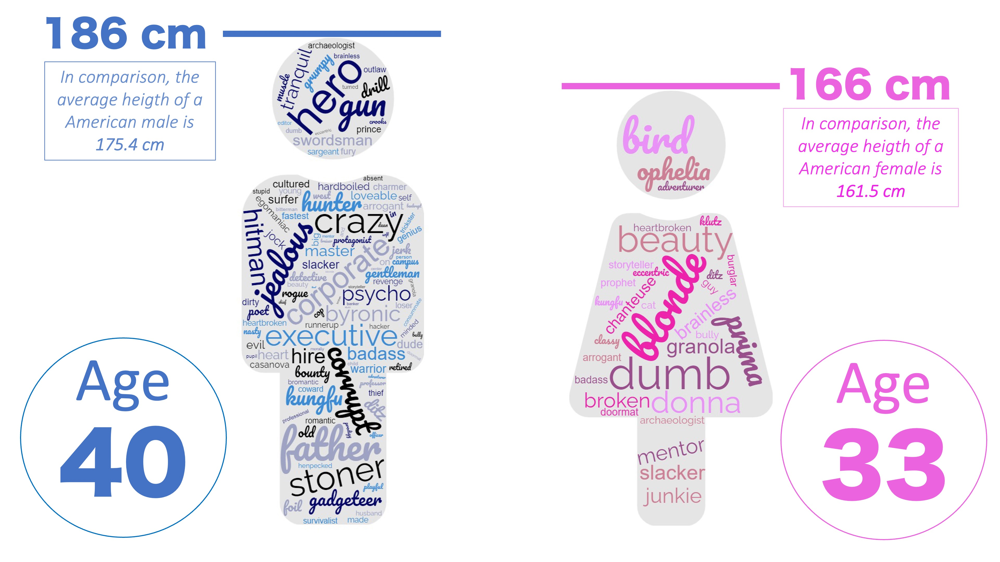

# Cinema: a patriarchal industry?

The cinema industry has a long and complex history when it comes to the representation and portrayal of women on screen. From the earliest days of film, women have often been relegated to supporting roles or objectified as props for male characters. Despite some notable exceptions, the industry has historically been dominated by men, both behind and in front of the camera.

In this article, we will explore the place of women in the cinema industry through the lens of data from the CMU Movie Summary Corpus, and additional data from the ImdB API.

We will explore the situation of women in the movie industry since the beginning of the 20th century. Is their an evolution across countries or movie genre?

Men and women might be portrayed differently on the movies. Is there an objectification of women? What about men?

We will finally investigate how men compare to women in terms of careers in the cinema industry. Is there a noticeable difference in how movies featuring them are perceived?

## Quick glance at the dataset

- ratio h/f
- plage temporelle
- nombre films
- nombre total de votes sur IMDb

## So few women?

### A look at the film industry by continent

Gender equality is not uniform across the globe, is this reflected in the cinema industry as well?

Our dataset contains % (nb_men - nb_women / nb_women) more men than women, but is this a common feature across the globe?

[Bar plot]

It appears that the disparities in women share is a constant independent of the region studied. Maybe averaging over all periods of time hides an era with a different tendency.

[interactive PLOT with ratio by region]

Despite looking more precisely at a year level, men remained predominant over women in every region, this since early 20th century.

Classifying movies by region does not highlight an ounce of equality when it comes to women place in the cinema. However another natural classification can be done over their genre.

### A gender analysis of movie genres

Look at these posters of action movies, no women to be found!

[POSTER 4-5 films]

Let's analyse the representation of women in specific movie genres and see whether some have more or less gender balance in terms of characters.

We will focus on the main genres in the film industry, including comedy, romance, thriller, drama, and action.

[PLOT with ratio par movie genre]

As expected, romance movies star more women than action movies, but the general trend remains the same: men still are predominant in the casting.

It is not enough to simply look at the number of men and women in the industry to accurately assess the role of women in the industry. We must also consider the quality of their representation, which can be determined by examining the types of characters they portray and whether or not they are given leading roles. By exploring these factors, we can gain a better understanding of how gender is portrayed in the industry.

## The archetypical role

### II.1 Adjective

Let's create a report on the typical male and female character archetypes, including few features such as their ages or heights, and which adjectives are used to qualify them.

[Cloud of word]

and the frequency with which their names appear in summaries. This latter metric indicates how often the character is the main protagonist of the movie, depending on its gender.

### II.2 Protagonist probability

We analyzed the plot summary data in the dataset and searched for character names to determine which characters are most likely to be the main protagonists. This allowed us to evaluate whether female characters are less likely to be featured prominently in the storylines.

[GRAPH avec share of appearance in the summary]

[Observation]

### II.3 Other metrics

Using the actor characteristics, we can determine the average height and age of each character, and examine whether there is a difference in these attributes between main characters and non-main characters.

[Observation]

[Conclusion on this part: avoir une sorte de fiche technique avec adjectifs principaux, taille ,age...]

In this section, we focused on describing the typical male and female characters and how being a main character affects these characteristics. Another aspect we could consider is the fame of the actors portraying the characters and whether there are differences based on their gender.

## III. Fame in perspective

## IV. Conclusion
